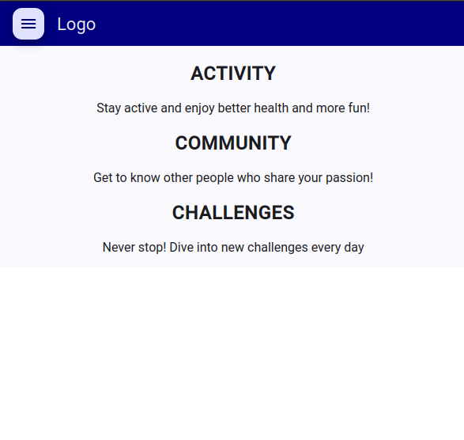
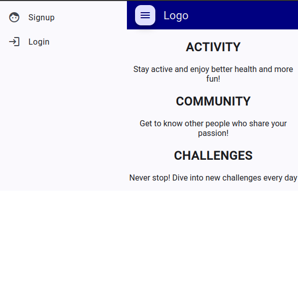
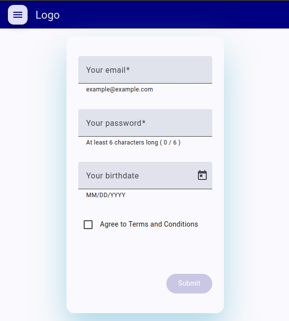
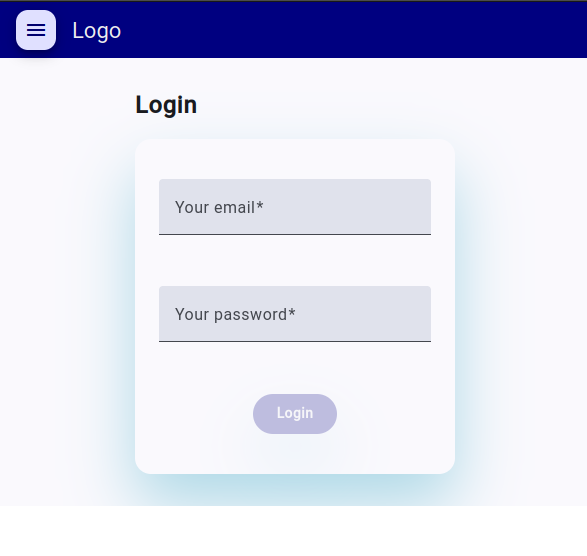
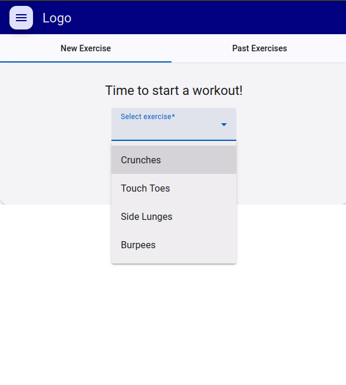
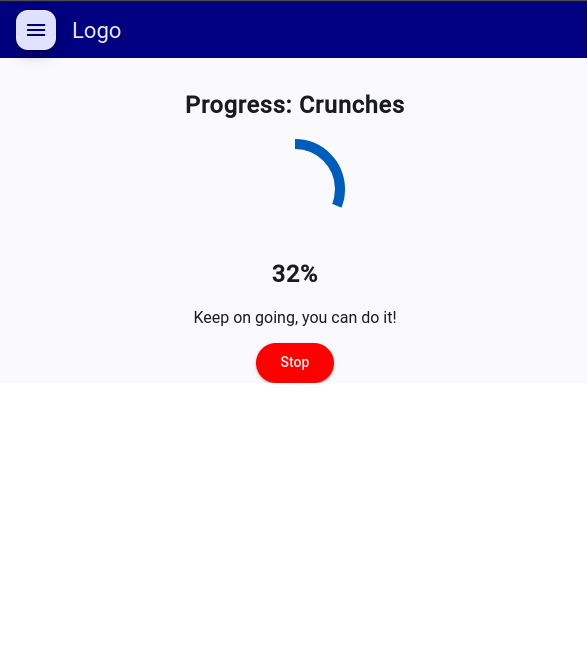
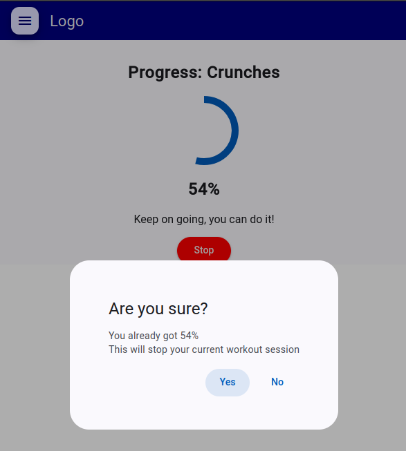
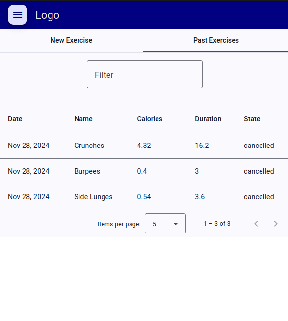

# training-log

demo responsive mobile application in Angular 18.

## features

- user logs exercises and keeps a list of past activities with details for progress duration, calories, date and state.
- user can apply a filter on top of activities
- user sets items per page

## technologies

- Typescript
- Angular version 18.2.12
- Angular material
- SASS

## deployment

- Firebase

## url

- [Link](https://training-log-demo.web.app/)

## screenshots

